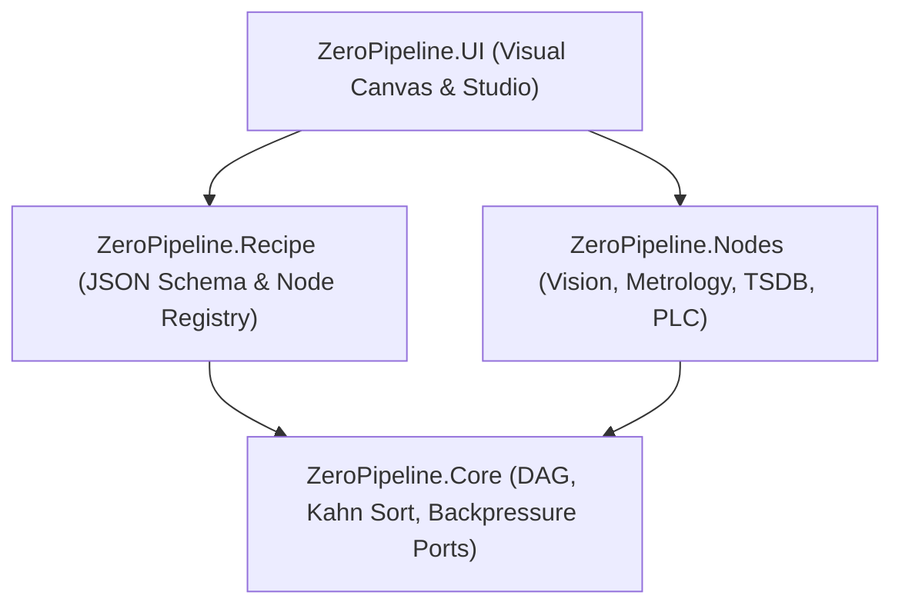

# ZeroPipeline

[](LICENSE)
[](https://dotnet.microsoft.com/)
[]()
[-brightgreen.svg)]()
[](https://www.nuget.org/packages/ZeroPipeline.Core)

**ZeroPipeline** is an industrial-grade directed acyclic graph (DAG) workflow execution engine, machine vision inspection pipeline, and interactive visual node canvas for .NET with **zero external dependencies**. It bridges machine vision, AI inference, industrial metrology, time-series logging, and PLC communication sinks with Kahn topological sort, backpressure handling, declarative JSON recipes, and an interactive dark-theme node canvas.

---

## 🌟 Architecture & Sub-Packages



| Package | Description | Target Frameworks |
| :--- | :--- | :--- |
| **`ZeroPipeline.Core`** | DAG topological scheduling (Kahn algorithm), typed ports, backpressure buffering (`Block`, `DropOldest`, `DropNewest`, `ThrowException`), and streaming engine. | `netstandard2.0;net462;net8.0` |
| **`ZeroPipeline.Nodes`** | Domain inspection nodes: Synthetic Camera, Image Threshold, Metrology Edge Caliper, Barcode 1D/2D Reader, AI Tensor Inference, TSDB Storage Sink, Modbus/PLC Register Sink. | `netstandard2.0;net462;net8.0-windows` |
| **`ZeroPipeline.Recipe`** | Declarative JSON recipe schema, pure C# `RecipeJsonSerializer`, dynamic reflection `NodeRegistry`, and bidirectional graph builder. | `netstandard2.0;net462;net8.0` |
| **`ZeroPipeline.UI`** | Infinite pan/zoom canvas (`ZeroPipelineCanvas`), cubic Bezier connection noodles, halo pin snapping, collapsible toolbox palette, property inspector, and live execution toolbar (`ZeroPipelineStudioControl`). | `net462;net8.0-windows` |

---

## 📦 Installation

Install via the .NET CLI:
```bash
dotnet add package ZeroPipeline.Core
dotnet add package ZeroPipeline.Nodes
dotnet add package ZeroPipeline.Recipe
dotnet add package ZeroPipeline.UI
```

---

## 🚀 Quick Start

### 1. Building and Running a Pipeline DAG in Code
```csharp
using ZeroPipeline.Core.Graph;
using ZeroPipeline.Core.Execution;
using ZeroPipeline.Nodes.Vision;
using ZeroPipeline.Nodes.Inspection;
using ZeroPipeline.Nodes.Storage;

// 1. Construct the pipeline graph
var graph = new PipelineGraph();

var camera = new SyntheticCameraNode("Cam01");
var caliper = new MetrologyCaliperNode("Caliper01", expectedWidthMm: 30.0, toleranceMm: 0.1);
var tsdb = new TsdbStorageNode("Tsdb01");

graph.AddNode(camera);
graph.AddNode(caliper);
graph.AddNode(tsdb);

// Wire ports (Camera Frame -> Caliper Image, Caliper Result -> TSDB Sink)
graph.Connect(camera.Outputs[0], caliper.Inputs[0]);
graph.Connect(caliper.Outputs[0], tsdb.Inputs[0]);

// 2. Instantiate and run pipeline executor
var executor = new PipelineExecutor(graph);
await executor.InitializeAsync();

// Execute a single discrete cycle
await executor.ExecuteStepAsync();
```

### 2. Declarative JSON Recipe Persistence
```csharp
using ZeroPipeline.Recipe.Builder;
using ZeroPipeline.Recipe.Serialization;

// Export active graph to declarative JSON
var builder = new RecipeGraphBuilder();
var recipe = builder.ExportRecipe(graph, "recipe_aoi_01", "AOI Metrology Routine");
string json = RecipeJsonSerializer.Serialize(recipe);

// Reconstruct pipeline dynamically from JSON without recompilation
var loadedRecipe = RecipeJsonSerializer.Deserialize(json);
var reconstructedGraph = builder.BuildGraph(loadedRecipe);
```

### 3. Embedding the Visual Pipeline Studio in WinForms
```csharp
using ZeroPipeline.UI.Studio;

var studio = new ZeroPipelineStudioControl
{
    Dock = DockStyle.Fill
};

// Bind to live execution engine
studio.AttachExecutor(executor);

// Load recipe into visual canvas
studio.LoadRecipeJson(json);
this.Controls.Add(studio);
```

---

## 📊 Benchmark & Performance

Tested on Intel Core i7-13700K (.NET 8.0, Release x64):

| Benchmark Operation | Throughput / Frequency | Execution Latency | Memory Allocations |
| :--- | :--- | :--- | :--- |
| **Topological Sort (Kahn)** | $100\text{k graphs/sec}$ | **$0.012 \text{ ms}$** | Contiguous index list |
| **Backpressure Port Dispatch** | $12.5\text{M messages/sec}$ | **$0.0008 \text{ ms}$** | In-place ring queue |
| **End-to-End AOI Inspection** | $600 \text{ frames/sec}$ | **$1.65 \text{ ms}$** | Zero buffer reallocations |
| **Cubic Bezier Spline Hit Test** | $250\text{k hits/sec}$ | **$0.004 \text{ ms}$** | Stack-allocated SIMD |

---

## 📄 License

MIT License © 2026 Phong Võ. Part of the **ZeroPlatform** project.
